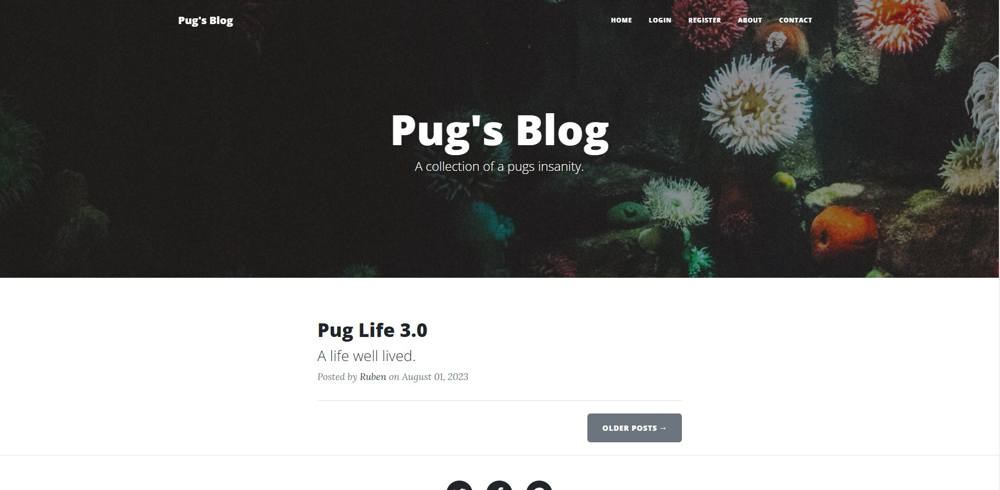
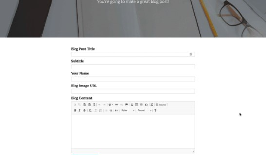
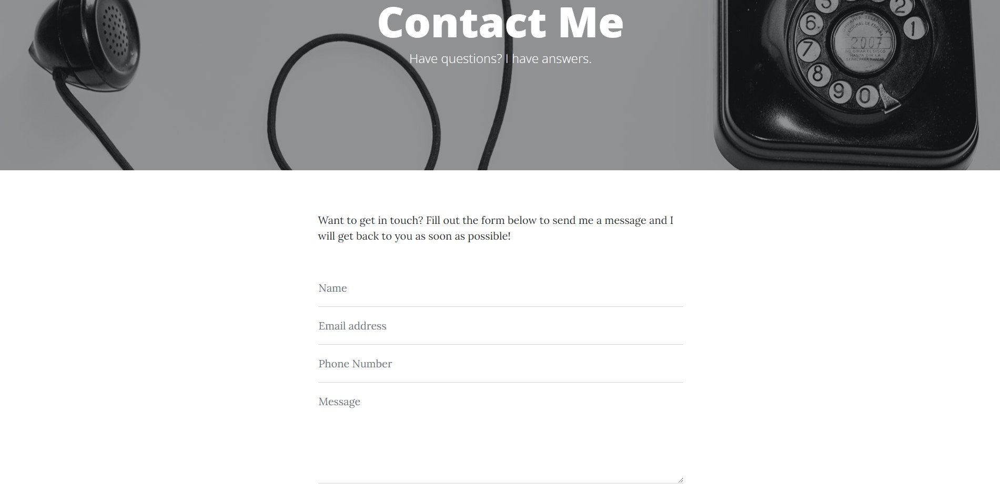

# Blogpost-website
A blogpost website with a Full-Stack architecture, a manifestation of everything we have learned this year.

## Technologies/Libraires & Modules used:
<ul>
  <li>Python</li>
  <li>CSS Bootstrap</li>
  <li>JavaScript</li>
  <li>Flask</li>
  <li>Jinja</li>
  <li>SQL_Alchemy</li>
  <li>PostgreSQL</li>
  <li>SMTPlib (email communication)</li>
  <li>OS (.env variables)</li>
</ul>

## What was learned/practiced:
<li>HTML/Jinja templating</li>
<li>Database modeling</li>
<li>Advanced authentication (hashing/salting)</li>
<li>HTML routing</li>
<li>Flask/PostgreSQL architecture</li>
<li>SQL tables and queries</li>

## Future updates/Further implementations:
1. Deploy to a WSGI server using GUnicorn
2. Dark mode
3. Create content

## A look at the website:
Website UI dependent on CSS Bootstrap and JavaScript, 
the blogpost is themed around the life of a surreal pug. 
 
 
 
 
Normal user key features: 
1.Read any posts 
2.View comments on any post 
3.Create comments 
4.Send emails 
 

 
 
Admin user key features: 
1.Create posts 
2.Update posts 
3.Delete posts 
 
 
 
 
Communication/contact with the website administrator established through email:
 
 
 
